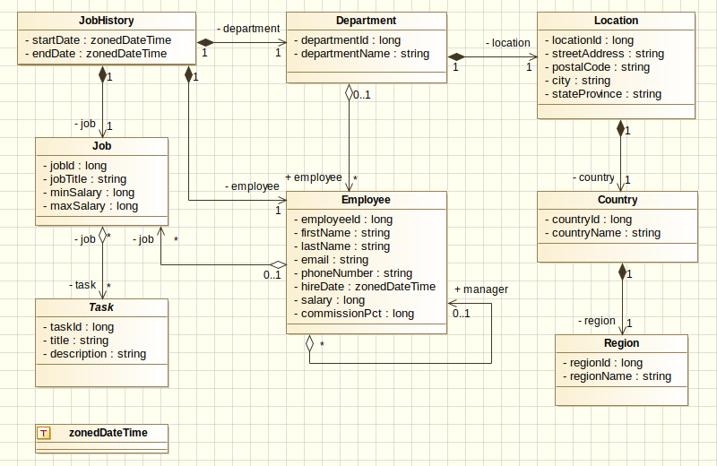

[TOC]

# Jhipster的安装与配置以及与WSO2IS的集成方法


# 前言

​         `Jhipster`是一个快速搭建应用的命令行脚手架工具。开发人员在**项目开始时**可以使用该工具快速生成符合技术潮流的应用程序架构（包括前端、后端、安全、日志、I18N、搜索引擎、性能监控、用户管理、`Docker`编排、实体关系CRUD前后端代码、数据库版本管理、CI-CD配置等组件）。在**项目迭代过程**中可以进行升级或扩展，在**项目部署阶段**可以使用该它类执行部署到主流云端环境。

​        `hipster`的原意是“赶时髦的人;潮人”，`Jhipster`意味着java领域的潮人。

> **使用`Jhipster`开发应用的工作流程如下：**
>
> - **1、规划应用的技术体系架构（项目名称、数据层、服务层、安全、包结构、前端框架等）；**
> - **2、使用UML建模工具设计领域对象模型并导出模型为XMI格式；**
> - **2、使用`Jhipster`生成项目框架；**
> - **3、使用Jhipster-uml工具生成JDL文件（*.jh)，然后使用文本编辑器修改和完善JDL文件中的实体信息（如：注释（自动转换为代码注释);**
> - **4、使用`Jhipster`的`import-jdl`子生成器来生成实体和关系的CRUD代码；**
> - **5、进行实体关系的国际化工作**；
> - **6、使用`Jhipster`的ci-cd子生成器生成DevOps需要的配置文件。**

# 一、Jhipster的安装与配置

## （一）安装和配置nodejs

### 1、下载nodejs

https://nodejs.org/en/download/

### 2、安装nodejs到D:\nodejs

```
cd d:\nodejs
mkdir  node_global
mkdir node_cache
```

### 3、配置环境变量:

```
NODE_PATH=d:\nodejs\node_global
PATH=%NODE_PATH%; d:\nodejs;……
```

### 4、配置NPM环境变量：

```has
npm config set prefix "D:\nodejs\node_global"
npm config set cache "D:\nodejs\node_cache"
npm config set registry https://registry.npm.taobao.org
```

注意：这三个命令设置的信息会保存在在C:\Users\用户名\.npmrc文件中，你也可以直接修改这个文件

### 5、检查版本

```
npm -v
node -v
```

## （二）安装Jhipster

```
npm install -g generator-jhipster
```

（可选）

```
npm install -g rimraf     #我的环境中需要安装，否则在执行jhipster过程中报rimraf不是有效的命令错误
```

## （三）使用Jhipster

```shell
mkdir d:\work
cd work
jhipster
```

运行：

```
#分别在两个终端执行如下命令：
mvnw
npm start
```
关于如何使用Jhipster的子生成器来生成实体/关系、生成CI-CD的配置，请参阅[Jhipster的官方文档](https://www.jhipster.tech/cn/)

## （四）实体代码的生成

有两种方法可以生成实体代码：

- 1、直接使用Jhipster的生成向导提示来生成；
- 2、使用JDL编写实体关系定义与描述文件（*.jh)，然后使用jhipster 的子生成器import-jdl来生成：

```
jhipster import-jdl  jh/demo.jh
```

> ***其中***：
>
> ​	实体关系定义与描述文件（*.jh)是一个文本文件，定义了一个或多个实体和关系信息。该文件必须使用jdl语言来编写。
>
> ​	编写jdl文件的工具：
>
> - ​	1、任何文本编辑器；
>
> - ​	2、使用[jhipster-studio](https://start.jhipster.tech/jdl-studio/)在线服务（该服务业不是使用docker快速部署到公司内部的研发环境中共开发团队使用）
>
> - ​	3、使用[jhipster-uml](https://www.jhipster.tech/cn/jhipster-uml/)命令行工具将一些可视化UML建模工具导出的`.xmi`文件转为实体关系定义与描述文件（*.jh)。其中：Jhipster UML是一个Jhipster子项目，可以用作使用[entity sub-generator](https://www.jhipster.tech/cn/creating-an-entity/)的替代。 其理念是，使用可视化工具 [manage relationships](https://www.jhipster.tech/cn/managing-relationships/) 比使用经典的Yeoman问答更容易。
>
>   

## （五）jhipster-uml的安装与使用

安装：

```shell
 npm install -g jhipster-uml
 或
 yarn global add jhipster-uml
```

使用：

生成jhipster应用之后，你可以从一些UML建模工具导出模型未XMI格式的文件，接下来在命令行进入你的应用根目录下执行如下的命令：

```shell
jhipster-uml <your_file.xmi>

```

注意：	

​	此时不需要指定数据库类型，jhipster-uml会从你在生成应用时生成的 *.yo-rc.json*文件（应用根目录下）中自动检测到数据库类型。

​	如果您希望在jhipster应用程序之外执行jhipster UML，则需要传递一个额外的参数：数据库类型名称。下面是要执行的命令：	

```shell
jhipster-uml <your_file.xmi> [--db (sql | mongodb | cassandra)]
```

也可以生成jhipster DTO，只需将--dto参数传递给它即可启用此功能。

```
jhipster-uml <your_file.xmi> [--db (sql | mongodb | cassandra)] [--dto]
```

可以使用--paginate为实体选择分页。

```
jhipster-uml <your_file.xmi> [--db (sql | mongodb | cassandra)] [--paginate]
```

您可以使用--service为您的实体选择服务。

```
jhipster-uml <your_file.xmi> [--db (sql | mongodb | cassandra)] [--service]
```

如果您需要帮助，还有一个命令：

```
jhipster-uml --help
```

### 1、jhipster-uml推荐的的UML建模工具下载及访问地址：

1. [Modelio](https://www.modelio.org/downloads/download-modelio.html)
2. [UML Designer](http://www.umldesigner.org/)
3. [GenMyModel](https://dashboard.genmymodel.com/)

### 2、示例模型



### 3、UML类图基础知识


- 车的类图结构为<<abstract>>，表示车是一个抽象类；
- 它有两个继承类：小汽车和自行车；它们之间的关系为实现关系，使用带空心箭头的虚线表示；
- 小汽车为与SUV之间也是继承关系，它们之间的关系为泛化关系，使用带空心箭头的实线表示；
- 小汽车与发动机之间是组合关系，使用带实心箭头的实线表示；
- 学生与班级之间是聚合关系，使用带空心箭头的实线表示；
- 学生与身份证之间为关联关系，使用一根实线表示；
- 学生上学需要用到自行车，与自行车是一种依赖关系，使用带箭头的虚线表示；

通过解读下面的类图，深入理解类之间的流中关系：

#### (1) 泛化关系(generalization)


#### (2) 实现关系(realize)


#### (3) 聚合关系(aggregation)

> 与组合关系不同的是，整体和部分不是强依赖的，即使整体不存在了，部分仍然存在；例如， 部门撤销了，人员不会消失，他们依然存在；


#### (4) 组合关系(composition)

> 组合关系是一种强依赖的特殊聚合关系，如果整体不存在了，则部分也不存在了；例如， 公司不存在了，部门也将不存在了；


#### (5) 关联关系(association)

> 乘车人和车票之间就是一种关联关系；学生和学校就是一种关联关系；
>
> 关联关系默认不强调方向，表示对象间相互知道；如果特别强调方向，如上图，表示A知道B，但 B不知道A；


#### (6) 依赖关系(dependency)

> 与关联关系不同的是，它是一种临时性的关系，通常在运行期间产生，并且随着运行时的变化； 依赖关系也可能发生变化；
>
> 


## （六）使用Jenkins流水线进行Jhipster应用的持续集成

### 方法：

1、在jhipster生成的应用目录下命令行执行：jhipster ci-cd ,选择jenkins pipline……然后会在根目录下生成一个Jenkinsfile的文件；

默认生成的流水线环节包括下图中的8个环节：


注：生成过程中你还可以选择部署到云端产品或测试环境等等……

2、提交并push到github
3、在jenkins中创建一个流水线任务即可（不要选择 “轻量级检出”复选框）。


### 出现的问题：

1、nohup: failed to run command 'sh': No such file or directory.
解决：根据构建日志中的提示，我修改了一个jenkins的全局配置项的键PATH 为PATH+EXTRA，保存后重新执行构建就好了。


# 二、与WSO2IS的集成

## (一） WSO2IS的配置

### 1、修改WSO2IS的身份配置文件中的repository/conf/identity/identity.xml的OIDCDiscoveryEPUrl元素的值：
修改
```xml
<OIDCDiscoveryEPUrl>${carbon.protocol}://${carbon.host}:${carbon.management.port}/oauth2/oidcdiscovery</OIDCDiscoveryEPUrl>
```
为
```xml
<OIDCDiscoveryEPUrl>${carbon.protocol}://${carbon.host}:${carbon.management.port}/oauth2/token</OIDCDiscoveryEPUrl>
```

### 2、注释掉WSO2IS的身份配置文件中的repository/conf/identity/identity.xml的包含(.*)/.well-known(.*)的Resource元素，以便oauth客户端程序可以使用https协议访问is的认证服务端点
```xml
<Resource context="(.*)/.well-known(.*)" secured="true" http-method="all"/>
```
注意：若不注释而使用https协议访问is的认证服务端点会报401 未授权错误

### 3、添加一个服务提供者

在IS中注册一个服务提供者，配置入站认证配置/OAuth / OpenID 连接配置，点击配置打开配置页面如下：


只需要设置回调URL如下：

```
regexp=(http://192.168.200.24:8080/login/oauth2/code/oidc|http://localhost:9000/login/oauth2/code/oidc|http://192.168.200.24:8080|http://localhost:9000)
```

> 注意：
>
> 多个回调URL之间用|分隔。回调URL的格式为:
>
> ```
> regexp=(登录回调URL|注销回调URL)
> ```
>
> 上例中：
>
> > http://192.168.200.24:8080/login/oauth2/code/oidc和http://localhost:9000/login/oauth2/code/oidc是登录回调URL，另外两个是注销回调URL（注销后跳转到那个地址）
> >
> > 之所以配置两个，是在开发模式下，会启动两个服务。

#### 用户和角色配置

在IS中添加两个用户：admin1和user1

在IS中添加两个角色：local_user和local_admin

分配admin1为local_admin，user1为local_user

#### 声明配置：


注意：这一步配置应用要获取那几个身份属性

#### 角色映射：

打开服务提供者的角色/权限配置，进行如下配置：


> 其中：
>
> 服务提供者的角色在应用的src/main/java/gds/demo/security/AuthoritiesConstants.java文件中硬编码

#### 修改应用的client-id和client-secret


在服务提供者的额配置页面上，复制client-id和client-secret到应用的src/main/resources/config/application.yml文件中的client-id和client-secret。如下所示：

```yaml
spring:
  ......
  security:
    oauth2:
      client:
        provider:
          oidc:
			......
        registration:
          oidc:
            client-id: rac6pHBoA96Qv6vSOB8fsEhXD5Ya
            client-secret: LlL6hGNeKfJ9Dolve2aWdjTml3oa
            client-name: OIDC测试应用
```

## （二） 应用的配置

### 添加一个ClientRegistration的配置类

添加一个ClientRegistration的配置类OAuth2LoginConfigForIS.该类负责给InMemoryClientRegistrationRepository库中注册一个身份认证服务器。代码如下：

```java
/**
 * 添加OAuth2LoginConfig类以使用特定于wso2的详细信息和将用于登录的已注册OAuth2客户端配置InMemoryCenterRegistrationRepository.
 */
@Configuration
public class OAuth2LoginConfig {
    private static String CLIENT_PROPERTY_KEY = "spring.security.oauth2.client.registration.oidc.";
    private static String PROVIDER_PROPERTY_KEY = "spring.security.oauth2.client.provider.oidc.";
    @Autowired
    private Environment env;

    @Bean
    public ClientRegistrationRepository
    clientRegistrationRepository() {
        return new InMemoryClientRegistrationRepository(this.buildClientRegistration());
    }

    private ClientRegistration buildClientRegistration() {
        Map<String, Object> metadata = new HashMap<>();
        metadata.put("end_session_endpoint", env.getProperty(PROVIDER_PROPERTY_KEY + "logout-uri")); 
        return ClientRegistration.withRegistrationId("oidc")           //这是应用的注册Id，这个id就是回调Url中的{registrationId}，命名：应用的英文名称
                .clientName(env.getProperty(CLIENT_PROPERTY_KEY + "client-name","OIDC应用"))   //这是应用的显示名称，应用注销后会显示在引导用户重新登录的页面上        		
                .clientId(env.getProperty(CLIENT_PROPERTY_KEY + "client-id"))
                .clientSecret(env.getProperty(CLIENT_PROPERTY_KEY + "client-secret"))
                .clientAuthenticationMethod(ClientAuthenticationMethod.BASIC)
                .authorizationGrantType(AuthorizationGrantType.AUTHORIZATION_CODE)
                .redirectUriTemplate("{baseUrl}/login/oauth2/code/{registrationId}")  //IS中添加的服务提供者的入站认证配置下的OAuth/OpenId连接配置中的回调Url须根据这个模板来填写
                .scope("openid", "profile", "email", "address", "phone")              //这是本应用期望从IS获取的用户个人信息的用途或范围，登录成功后，系统要求用户确认是否愿意提供这些信息。
                .authorizationUri(env.getProperty(PROVIDER_PROPERTY_KEY + "authorization-uri"))
                .tokenUri(env.getProperty(PROVIDER_PROPERTY_KEY + "token-uri"))
                .userInfoUri(env.getProperty(PROVIDER_PROPERTY_KEY + "user-info-uri"))
                .userNameAttributeName(IdTokenClaimNames.SUB)
                .providerConfigurationMetadata(metadata)
                .jwkSetUri(env.getProperty(PROVIDER_PROPERTY_KEY + "jwk-set-uri"))
                 .build();
    }
}
```

说明：

>  * 添加OAuth2LoginConfig类以使用特定于wso2的详细信息和将用于登录的已注册OAuth2客户端配置InMemoryCenterRegistrationRepository.
>
>  * 说明：Jhipster支持注册多个ClientRegistration，以便同时支持用户选择不同的身份提供者登录。
>
>  * Jhipster缺省生成的Oauth/OpenId应用代码中使用了RegistrationId为oidc的ClientRegistration。
>
>  * 如果要修改这个RegistrationId为其它值，需要修改三个文件中硬编码的oidc为新的RegistrationId：
>
>  * 1、本类中的ClientRegistration.withRegistrationId("oidc")
>
>  * 2、xx.xx.web.rest.LogoutResource类的构造函数的实现：
>
>    ```java
>    this.registration = registrations.findByRegistrationId("oidc");
>    ```
>
>    
>
>  * 3、src/main/webapp/app/shared/util/url-utils.ts文件中的
>
>    ```typescript
>    return `//${location.hostname}${port}${location.pathname}oauth2/authorization/oidc`;
>    ```
>
>    
>
>  * 此外，还需要在身份提供者中注册应用（服务提供者）时的回调URL中做相应的修改。如：在wso2is中注册服务提供者时，指定的回调URL如下： 
>
>    ```properties
>    regexp=(http://192.168.200.24:8080/login/oauth2/code/oidc|http://localhost:9000/login/oauth2/code/oidc|http://192.168.200.24:8080|http://localhost:9000)
>    ```
>
>    如果要配置多个ClientRegistration，且同时支持多个不同的身份提供者登录，需要将 * url-utils.ts文件中的
>
>    ```typescript
>    return `//${location.hostname}${port}${location.pathname}oauth2/authorization/oidc`;
>    ```
>
>    修改为
>
>    ```typescript
>    return `//${location.hostname}${port}${location.pathname}login`;
>    ```
>
>    这样，但用户点击登录时，系统自动跳转到spring安全生成的登录页面中，该页面上列出了全部已注册的ClientRegistration，用户选择后就可以使用不同的身份登录本应用了。

### 修改安全配置

1、修改/src/main/resources/config/application.yml中spring:security:oauth2:client的参数如下：

```yaml
spring:
  ......
  security:
    oauth2:
      client:
        provider:
          oidc:
            issuer-uri: https://is.cd.mtn:9443/oauth2/token
            logout-uri: https://is.cd.mtn:9443/oidc/logout
            authorization-uri: https://is.cd.mtn:9443/oauth2/authorize
            token-uri: https://is.cd.mtn:9443/oauth2/token
            user-info-uri: https://is.cd.mtn:9443/oauth2/userinfo
            jwk-set-uri: https://is.cd.mtn:9443/oauth2/jwks
        registration:
          oidc:
            client-id: rac6pHBoA96Qv6vSOB8fsEhXD5Ya
            client-secret: LlL6hGNeKfJ9Dolve2aWdjTml3oa
            client-name: OIDC测试应用
```

2、修改src/main/docker/app.yml文件，添加相关环境变量如下：

```yaml
version: '2'
services:
  jhi_oauth2_app1-app:
    image: jhi_oauth2_app1
    environment:
      - _JAVA_OPTIONS=-Xmx512m -Xms256m
      - SPRING_PROFILES_ACTIVE=prod,swagger
      - MANAGEMENT_METRICS_EXPORT_PROMETHEUS_ENABLED=true
      - SPRING_DATASOURCE_URL=jdbc:mysql://jhi_oauth2_app1-mysql:3306/jhi_oauth2_app1?useUnicode=true&characterEncoding=utf8&useSSL=false
      - SPRING_SECURITY_OAUTH2_CLIENT_REGISTRATION_OIDC_CLIENT_ID=rac6pHBoA96Qv6vSOB8fsEhXD5Ya
      - SPRING_SECURITY_OAUTH2_CLIENT_REGISTRATION_OIDC_CLIENT_SECRET=LlL6hGNeKfJ9Dolve2aWdjTml3oa
      - SPRING_SECURITY_OAUTH2_CLIENT_REGISTRATION_OIDC_CLIENT_NAME=OIDC测试应用
      - SPRING_SECURITY_OAUTH2_CLIENT_PROVIDER_OIDC_ISSUER_URI=https://is.cd.mtn:9443/oauth2/token
      - SPRING_SECURITY_OAUTH2_CLIENT_PROVIDER_OIDC_LOGOUT_URI=https://is.cd.mtn:9443/oidc/logout
      - SPRING_SECURITY_OAUTH2_CLIENT_PROVIDER_OIDC_AUTHORIZATION_URI=https://is.cd.mtn:9443/oauth2/authorize
      - SPRING_SECURITY_OAUTH2_CLIENT_PROVIDER_OIDC_TOKEN_URI=https://is.cd.mtn:9443/oauth2/token
      - SPRING_SECURITY_OAUTH2_CLIENT_PROVIDER_OIDC_USER_INFO_URI=https://is.cd.mtn:9443/oauth2/userinfo
      - SPRING_SECURITY_OAUTH2_CLIENT_PROVIDER_OIDC_JWK_SET_URI=https://is.cd.mtn:9443/oauth2/jwks
      - JHIPSTER_SLEEP=30 # gives time for other services to boot before the application
    ports:
      - 8080:8080
  jhi_oauth2_app1-mysql:
    extends:
      file: mysql.yml
      service: jhi_oauth2_app1-mysql
  keycloak:
    extends:
      file: keycloak.yml
      service: keycloak
```

### 最佳实践：

1、常规方式部署时，我们还可以使用如下的环境变量，以便在系统外部重载这些参数：

```shell
export SPRING_SECURITY_OAUTH2_CLIENT_REGISTRATION_OIDC_CLIENT_ID=rac6pHBoA96Qv6vSOB8fsEhXD5Ya
	export SPRING_SECURITY_OAUTH2_CLIENT_REGISTRATION_OIDC_CLIENT_SECRET=LlL6hGNeKfJ9Dolve2aWdjTml3oa
	export SPRING_SECURITY_OAUTH2_CLIENT_REGISTRATION_OIDC_CLIENT_NAME=OIDC测试应用
	export SPRING_SECURITY_OAUTH2_CLIENT_PROVIDER_OIDC_ISSUER_URI=https://is.cd.mtn:9443/oauth2/token
	export SPRING_SECURITY_OAUTH2_CLIENT_PROVIDER_OIDC_LOGOUT_URI=https://is.cd.mtn:9443/oidc/logout
	export SPRING_SECURITY_OAUTH2_CLIENT_PROVIDER_OIDC_AUTHORIZATION_URI=https://is.cd.mtn:9443/oauth2/authorize
	export SPRING_SECURITY_OAUTH2_CLIENT_PROVIDER_OIDC_TOKEN_URI=https://is.cd.mtn:9443/oauth2/token
	export SPRING_SECURITY_OAUTH2_CLIENT_PROVIDER_OIDC_USER_INFO_URI=https://is.cd.mtn:9443/oauth2/userinfo
	export SPRING_SECURITY_OAUTH2_CLIENT_PROVIDER_OIDC_JWK_SET_URI=https://is.cd.mtn:9443/oauth2/jwks
```

2、在Docker容器中部署时，我们可以使用docker run 的-e 选项来重载这些参数。

# 三、遇到的问题

## 1、hostname verify导致PKIX问题

应用启动时报错：Caused by: sun.security.provider.certpath.SunCertPathBuilderException: unable to find valid certification path to requested target

解决办法有两个：

- 一是导入is的公钥到应用运行环境的jre/lib/security/cacerts证书库中
- 二是添加配置类来自动信任服务端，不做hostname验证。该配置类的实现代码如下所示：

```java
package gds.demo;

import javax.net.ssl.HostnameVerifier;
import javax.net.ssl.HttpsURLConnection;
import javax.net.ssl.SSLContext;
import javax.net.ssl.SSLSession;
import javax.net.ssl.SSLSocketFactory;
import javax.net.ssl.TrustManager;
import javax.net.ssl.X509TrustManager;
import javax.servlet.ServletException;

import org.springframework.context.annotation.Configuration;

@Configuration
public class HostNameVerify {
	
	public HostNameVerify() {
		super();
		try {
			disableHostNameVerify();
		} catch (ServletException e) {
			e.printStackTrace();
		}
	}

	private void disableHostNameVerify() throws ServletException {
		try {

			SSLContext sc;

			// 获取 SSL 上下文
			sc = SSLContext.getInstance("SSL");

			// 创建一个空的HostnameVerifier
			HostnameVerifier hv = new HostnameVerifier() {
				public boolean verify(String urlHostName, SSLSession session) {
					return true;
				}
			};

			// 不就行证书链验证的信任管理器
			TrustManager[] trustAllCerts = new TrustManager[] { new X509TrustManager() {
				public java.security.cert.X509Certificate[] getAcceptedIssuers() {
					return null;
				}

				public void checkClientTrusted(java.security.cert.X509Certificate[] certs, String authType) {
				}

				public void checkServerTrusted(java.security.cert.X509Certificate[] certs, String authType) {
				}
			} };

			sc.init(null, trustAllCerts, new java.security.SecureRandom());
			SSLSocketFactory sslSocketFactory = sc.getSocketFactory();

			HttpsURLConnection.setDefaultSSLSocketFactory(sslSocketFactory);
			SSLContext.setDefault(sc);
			HttpsURLConnection.setDefaultHostnameVerifier(hv);
		} catch (Exception e) {
			throw new ServletException(e);
		}
	}   
}

```

## 2、如果is用户没有email时报空指针异常的问题

修改**.service.UserService类的 `clearUserCaches(User user)`方法如下：

```java
    private void clearUserCaches(User user) {
    	try {
    	      Objects.requireNonNull(cacheManager.getCache(UserRepository.USERS_BY_LOGIN_CACHE)).evict(user.getLogin());
    	      Objects.requireNonNull(cacheManager.getCache(UserRepository.USERS_BY_EMAIL_CACHE)).evict(user.getEmail());
		} catch (Exception e) {
			//
		}
  
    }
```

捕获异常，但不抛出异常，以便支持用户email为空的情况。

# 四、Jhipster的示例应用jhi_oauth2_app1介绍

此应用程序是使用Jhipster 6.1.0生成的，您可以在[https://www.jhipster.tech/documentation-archive/v6.1.0](https://www.jhipster.tech/documentation-archive/v6.1.0).发现相关的文档

## 开发

在生成此项目之前，必须在计算机上安装和配置以下依赖项:

1. [Node.js][]: 我们使用node运行开发Web服务器并构建项目.
   根据您的系统，您可以从源代码或作为预打包的包安装nodejs.

安装node之后，您应该能够运行以下命令来安装开发工具。
仅当 [package.json](package.json)文件中的依赖项更改时才需要运行此命令

    npm install

我们使用npm 和 [Webpack][] 作为我们的构建系统.

在两个独立的终端中运行以下命令，在浏览器中创建一个幸福的开发体验
当硬盘上的文件更改时自动刷新.

    ./mvnw
    npm start

## OAuth 2.0 / OpenID Connect

祝贺你！您选择了一种很好的方法来保护您的Jhipster应用程序。如果您不确定OAuth和OpenID Connect（OIDC）是什么，请参阅 [What the Heck is OAuth?](https://developer.okta.com/blog/2017/06/21/what-the-heck-is-oauth)

To log in to your app, you'll need to have [Keycloak](https://keycloak.org) up and running. The JHipster Team has created a Docker container for you that has the default users and roles. Start Keycloak using the following command.

```
docker-compose -f src/main/docker/keycloak.yml up
```

The security settings in `src/main/resources/application.yml` are configured for this image.

```yaml
spring:
  ...
  security:
    oauth2:
      client:
        provider:
          oidc:
            issuer-uri: http://localhost:9080/auth/realms/jhipster
        registration:
          oidc:
            client-id: web_app
            client-secret: web_app
```

### Okta

If you'd like to use Okta instead of Keycloak, you'll need to change a few things. First, you'll need to create a free developer account at <https://developer.okta.com/signup/>. After doing so, you'll get your own Okta domain, that has a name like `https://dev-123456.okta.com`.

Modify `src/main/resources/application.yml` to use your Okta settings.

```yaml
spring:
  ...
  security:
    oauth2:
      client:
        provider:
          oidc:
            issuer-uri: https://{yourOktaDomain}/oauth2/default
        registration:
          oidc:
            client-id: {clientId}
            client-secret: {clientSecret}
security:
```

Create an OIDC App in Okta to get a `{clientId}` and `{clientSecret}`. To do this, log in to your Okta Developer account and navigate to **Applications** > **Add Application**. Click **Web** and click the **Next** button. Give the app a name you’ll remember, specify `http://localhost:8080` as a Base URI, and `http://localhost:8080/login/oauth2/code/oidc` as a Login Redirect URI. Click **Done**, then Edit and add `http://localhost:8080` as a Logout redirect URI. Copy and paste the client ID and secret into your `application.yml` file.

> **TIP:** If you want to use the [Ionic Module for JHipster](https://www.npmjs.com/package/generator-jhipster-ionic), you'll need to add `http://localhost:8100` as a **Login redirect URI** as well.

Create a `ROLE_ADMIN` and `ROLE_USER` group and add users into them. Modify e2e tests to use this account when running integration tests. You'll need to change credentials in `src/test/javascript/e2e/account/account.spec.ts` and `src/test/javascript/e2e/admin/administration.spec.ts`.

Navigate to **API** > **Authorization Servers**, click the **Authorization Servers** tab and edit the default one. Click the **Claims** tab and **Add Claim**. Name it "roles", and include it in the ID Token. Set the value type to "Groups" and set the filter to be a Regex of `.*`.

After making these changes, you should be good to go! If you have any issues, please post them to [Stack Overflow](https://stackoverflow.com/questions/tagged/jhipster). Make sure to tag your question with "jhipster" and "okta".

### Service workers

Service workers are commented by default, to enable them please uncomment the following code.

- The service worker registering script in index.html

```html
<script>
  if ('serviceWorker' in navigator) {
    navigator.serviceWorker.register('./service-worker.js').then(function() {
      console.log('Service Worker Registered');
    });
  }
</script>
```

Note: workbox creates the respective service worker and dynamically generate the `service-worker.js`

### 依赖管理

例如, 要添加 [Leaflet][] 库作为运行时依赖,请运行一下命令:

```shell
npm install --save --save-exact leaflet
```

要在开发模式下从 [DefinitelyTyped][] 库中的TypeScript获益，你可以运行一下命令:

```shell
npm install --save-dev --save-exact @types/leaflet
```

然后导入库安装说明中指定的JS和CSS文件，以便Webpack了解它们。:
注意: 针对 Leaflet 还有几件事要做，我们在这里不详述.

有关如何使用Jhipster开发的更多说明，请查看 [Using JHipster in development][].

## 构建你的应用

### 打为 jar包

```shell
./mvnw -Pprod clean verify
```

这将连接并缩小客户机的CSS和JavaScript文件。它还将修改index.html，以便引用这些新文件。
为确保一切正常，请运行：

```shell
java -jar target/*.jar
```

在浏览器中访问 [http://localhost:8080](http://localhost:8080) .

查看 [Using JHipster in production][] 了解详情.

### 打为war包

```shell
./mvnw -Pprod,war clean verify
```

## 测试

```shell
./mvnw verify
```

### 客户端测试

Unit tests are run by [Jest][] and written with [Jasmine][]. They're located in [src/test/javascript/](src/test/javascript/) and can be run with:

单元测试由Jest运行，并用Jasmine编写。它们位于src/test/javascript/中，可以通过以下方式运行：

    npm test

For more information, refer to the [Running tests page][].

### 分析编码质量

声纳用于分析编码质量。你可以启动本地声纳服务器 (访问 http://localhost:9001) :

```
docker-compose -f src/main/docker/sonar.yml up -d
```

您可以使用声纳扫描仪或使用Maven插件运行声纳分析。然后，进行声纳分析：

```
./mvnw -Pprod clean verify sonar:sonar
```

如果需要重新运行声纳阶段，请确保至少指定初始化阶段，因为声纳属性是从sonar-project.properties文件加载的。

```
./mvnw initialize sonar:sonar
```

或者

查看详情,请参考 [Code quality page][].

## 使用 Docker 简化开发 (可选)

You can use Docker to improve your JHipster development experience. A number of docker-compose configuration are available in the [src/main/docker](src/main/docker) folder to launch required third party services.

For example, to start a mysql database in a docker container, run:

    docker-compose -f src/main/docker/mysql.yml up -d

To stop it and remove the container, run:

    docker-compose -f src/main/docker/mysql.yml down

您还可以将应用程序及其依赖的所有服务完全固定。
要实现这一点，首先通过运行以下命令构建应用程序的Docker映像：

    ./mvnw -Pprod verify jib:dockerBuild

然后运行:

    docker-compose -f src/main/docker/app.yml up -d

For more information refer to [Using Docker and Docker-Compose][], this page also contains information on the docker-compose sub-generator (`jhipster docker-compose`), 它能够为一个或多个Jhipster应用程序生成Docker配置.

## 持续集成 (optional)

要为项目配置CI，请运行CI CD子生成器（Jhipster CI CD），这将允许您为许多连续集成系统生成配置文件。有关详细信息，请参阅设置持续集成页面[Setting up Continuous Integration][] .

To configure CI for your project, run the ci-cd sub-generator (`jhipster ci-cd`), this will let you generate configuration files for a number of Continuous Integration systems. Consult the [Setting up Continuous Integration][] page for more information.

[jhipster homepage and latest documentation]: https://www.jhipster.tech
[jhipster 6.1.0 archive]: https://www.jhipster.tech/documentation-archive/v6.1.0
[using jhipster in development]: https://www.jhipster.tech/documentation-archive/v6.1.0/development/
[using docker and docker-compose]: https://www.jhipster.tech/documentation-archive/v6.1.0/docker-compose
[using jhipster in production]: https://www.jhipster.tech/documentation-archive/v6.1.0/production/
[running tests page]: https://www.jhipster.tech/documentation-archive/v6.1.0/running-tests/
[code quality page]: https://www.jhipster.tech/documentation-archive/v6.1.0/code-quality/
[setting up continuous integration]: https://www.jhipster.tech/documentation-archive/v6.1.0/setting-up-ci/
[node.js]: https://nodejs.org/
[yarn]: https://yarnpkg.org/
[webpack]: https://webpack.github.io/
[angular cli]: https://cli.angular.io/
[browsersync]: http://www.browsersync.io/
[jest]: https://facebook.github.io/jest/
[jasmine]: http://jasmine.github.io/2.0/introduction.html
[protractor]: https://angular.github.io/protractor/
[leaflet]: http://leafletjs.com/
[definitelytyped]: http://definitelytyped.org/