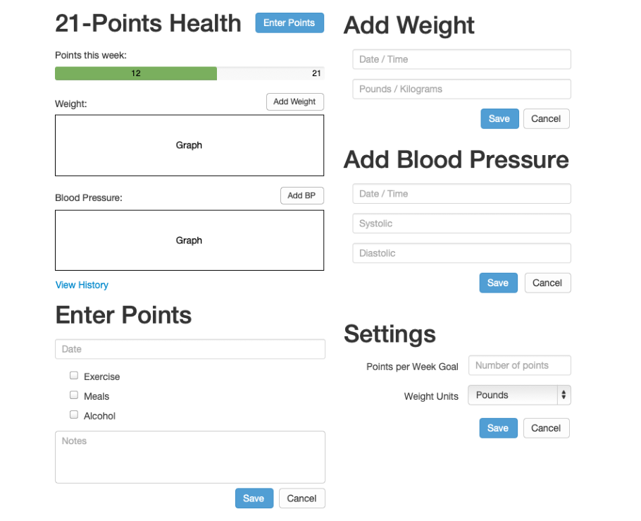
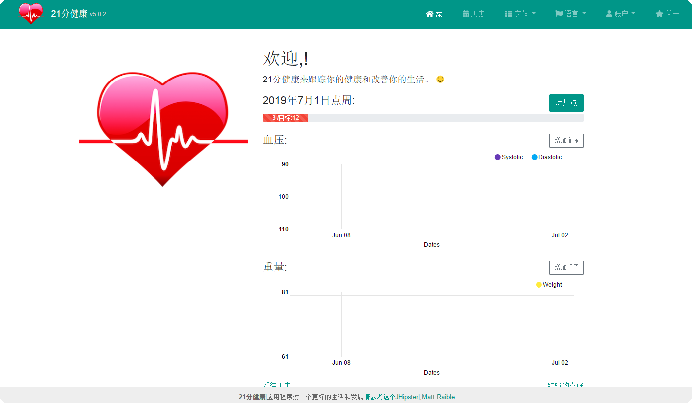
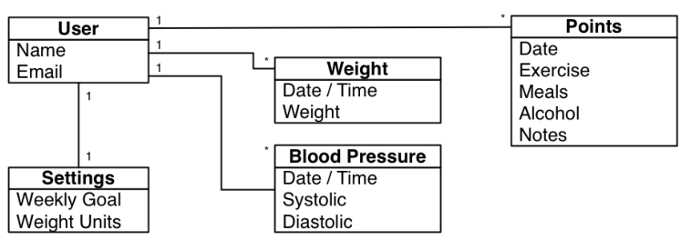
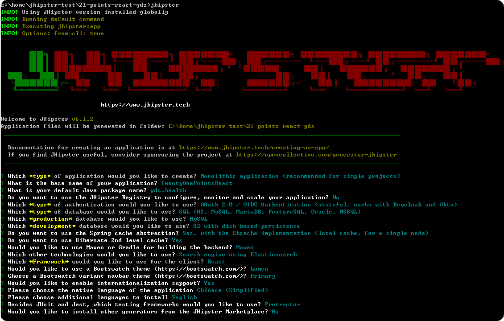
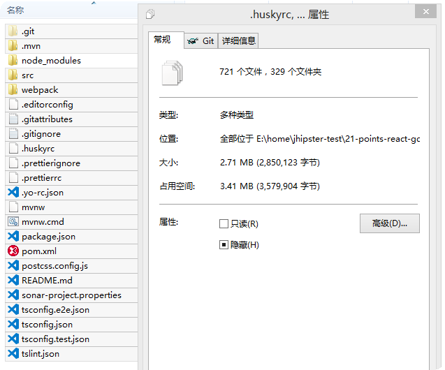
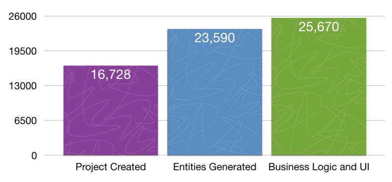
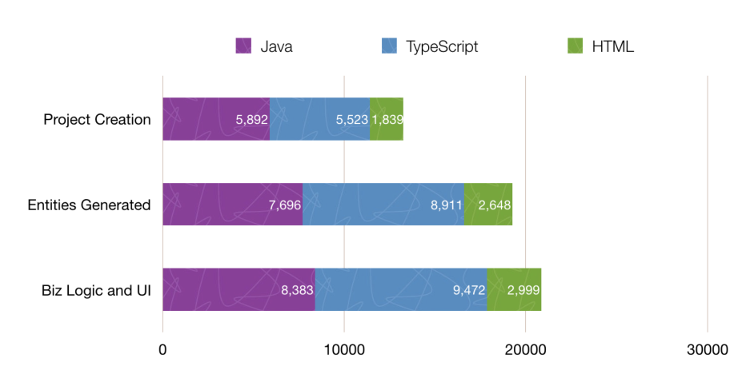

[TOC]

# 使用`Jhipster`进行React+ Web单体应用开发培训教程

## 一、培训目标

通过指导学员对21点健康管理应用的实现过程，让学员掌握以下技能：

> 1. 使用`Jhipster`生成应用框架；
> 2. 掌握使用UML进行领域建模并使用`Jhipster`将模型生成实体CRUD；
> 3. 添加业务逻辑，如：非管理员用户只能访问他们自己的数据；
> 4. 添加REST API并进行测试；
> 5. 单元测试使用`Junit`和`Jest`进行前后端单元测试；
> 6. 使用`Protractor`进行端到端（`e2e,End to End`）测试；
> 7. 使用Jenkins进行持续集成和持续部署(CI-CD)；
> 8. 使用sonar进行代码质量分析（选修）；
> 9. 如何开发PWA（Progressive web apps 渐进式网络应用程序。特点：脱机、快速、类APP。类似于微信小程序）（选修）；
> 10. 初步掌握React的前端开发和Spring Boot后端开发的基本知识。
> 11. 使用`Oauth2/OpenID`进行应用的安全认证与授权
> 12. 初步掌握`Jhipster`应用于`wso2is`进行集成的过程；
> 13. 使用`docker compose`进行服务的编排

## 二、培训课程安排

1、学习21点健康管理应用业务需求  `30分钟`；

2、安装开发环境Java、maven、`nodejs`    2小时；

3、安装`generator-jhipster（npm install -g  generator-jhipster`）;   30分钟

4、练习使用`jhipster`生成不同配置的应用；  2小时

5、使用使用`jhipster`生成21点健康管理应用并进行定制开发； 4天

6、在wso2is中注册服务提供者并使用`OAuth2/OpenID`与本应用集成【认证、授权、SSO及隐私管理】 2小时

7、使用Jenkins进行CI-CD。3小时

## 三、21点健康管理应用业务需求

> 1、注册到本系统的用户都可以添加自己每天的健康积分值、血压（收缩压和舒张压）和体重（公斤和磅两种单位）；
>
> > 其中***健康积分值***的积分规则如下：
> >
> > 1. 如果你觉得你当天吃的很健康（低糖低脂），得1分，否则得0分；
> > 2. 如果你觉得你今天锻炼了实体，得1分，否则得0分；
> > 3. 如果你觉得你当天没有喝酒，得1分，否则得0分；
> > 4. 每个用户每天最多积3分，每周最多21分。
>
> 
>
> 2、系统管理员可以给不同的用户添加和登记、修改和查看他的积分和健康状况；
>
> 3、每个用户可以设置他期望每周能达到的健康目标（大于10小于等于21分）以及体重的单位；
>
> 4、普通用户登录系统后，可以在首页查看他的健康积分及进度条（离目标的距离），血压变化曲线和体重变化曲线；
>
> 5、管理员用户可以选择不同的用户来查看他们的健康情况；
>
> 6、用户可以查看自己的历史积分，可以显示在日历组件上。以便更加直观地查看哪天登记了哪天为登记。

## 四、21点健康管理应用UI原型



> <font color='red'>为了进一步理解业务需求，强烈建议你访问https://www.21-points.com查看马特.雷布尔部署的在线21点健康管理应用。</font>



## 五、业务领域实体关系图




## 六、操练准备

> 1. 安装和配置开发环境jdk8、maven、`nodejs`、`git`        ; 1小时     
> 2. 安装`generator-jhipster（npm install -g  generator-jhipster`）;   30分钟
> 3. 练习使用`jhipster`生成不同配置的应用；  2小时

## 1 安装和配置nodejs

### 1)、下载nodejs

https://nodejs.org/en/download/

### 2)、安装nodejs到D:\nodejs

```
cd d:\nodejs
mkdir  node_global
mkdir node_cache
```

### 3)、配置环境变量:

```
NODE_PATH=d:\nodejs\node_global
PATH=%NODE_PATH%; d:\nodejs;……
```

### 4)、配置NPM环境变量：

```has
npm config set prefix "D:\nodejs\node_global"
npm config set cache "D:\nodejs\node_cache"
npm config set registry https://registry.npm.taobao.org
```

注意：这三个命令设置的信息会保存在在C:\Users\用户名\.npmrc文件中，你也可以直接修改这个文件

### 5)、检查版本

```
npm -v
node -v
```

## 2 安装Jhipster

```
npm install -g generator-jhipster
```

（可选）

```
npm install -g rimraf     #我的环境中需要安装，否则在执行jhipster过程中报rimraf不是有效的命令错误
```

## 3 使用Jhipster

```shell
mkdir d:\work
cd work
jhipster
```

运行：

```
#分别在两个终端执行如下命令：
mvnw
npm start
```

<font color='red'>详见我的另外一篇文章`Jhipster`的安装与配置以及与WSO2IS的集成方法</font>

## 七、研发任务分解及操练步骤

说明：

1、针对这个任务，你可以参考的文档：马特.雷布尔编写的  [`JHipster-minibook`](https://corneliu.cl/docs/jHipster-5.pdf)

2、你可以执行如下的命令来拉取牛人对这个需求的实现代码并分析其git log来使用最新版的`jhipster`来把该需求按照下面的任务分解重新实现一遍并在小组不断总结和讨论。

```
git clone https://github.com/robmelfi/21-points-react.git
```

> 1、快速生成应用程序框架（后端Spring Boot， 前端使用React，认证使用`OAuth2/OpenID`，缓存使用`Ehcache`、搜索引擎使用`Elasticsearch` 、主题使用`Bootswatch`的主题、单元测试使用`Junit`和`Jest`，端到端（`e2e,End to End`）测试使用`Protractor`,开发阶段使用数据库`H2 Disk-Based`，产品化部署使用`Mysql`）；
>
> ```
> mkdir d:\jhipster-dev
> cd /D d:\jhipster-dev
> mkdir 21-points-react-wangf
> cd 21-points-react-wangf
> jhipster
> 
> git commit -am '初始化项目'
> ```
>
> 2、在wso2is中注册服务提供者并使用`OAuth2/OpenID`与本应用集成【认证、授权、SSO及隐私管理】；
>
> ```
> 参见我的另外一篇文章Jhipster的安装与配置以及与WSO2IS的集成方法
> 或者访问 
> https://github.com/tongpi/jhi-oauth2-app1
> 感兴趣的可以克隆该项目到本地并查看提交日志来分析详细的配置过程。实际上我走了许多弯路。
> 
> 最佳实践：
> git branch feature-oauth2-conf
> 在feature-oauth2-conf分支上进行与IS的集成工作
> git checkout master
> git merge feature-oauth2-conf
> ```
>
> 3、设计实体并生成实体的CRUD前后端代码【四个业务实体表（健康积分、血压、体重、偏好）】；
>
> ```
> jhipster import-jdl 21-points.jh
> 
> 最佳实践：
> git branch feature-entity-crud
> 在feature-entity-crud分支上进行实体代码生成
> git checkout master
> git merge feature-entity-crud
> ```
>
> <font color='red'>注：21-points.jh文件的内容见本文附件3</font>
>
> 4、定制生成的实体前端页面；
>
> 参见：
> https://github.com/robmelfi/21-points-react/commit/ac053974afa3da98461291ce60cfc1b6f431062f
>
> ```
> 最佳实践：
> git branch ui-layout-polish
> 在feature-entity-crud分支上进行页面布局美化
> git checkout master
> git merge ui-layout-polish
> ```
>
> 5、添加逻辑来控制非管理员用户只能访问他们自己的数据（前端和后端均要控制）；
>
> 参见：
>
> https://github.com/robmelfi/21-points-react/commit/0c440a283d414e32e2bc3e7c851bfa961168b7cb
>
> ```
> 最佳实践：
> git branch acl
> 在feature-entity-crud分支上添加业务访问控制逻辑
> git checkout master
> git merge acl
> ```
>
> 6、修改上一步业务逻辑的测试代码；
>
> 参见：
>
> https://github.com/robmelfi/21-points-react/commit/4857821a657c0f52a007d280ecd513b954559cad
>
> ```
> 最佳实践：
> git branch fix-test-acl
> 在feature-entity-crud分支上添加业务访问控制逻辑
> git checkout master
> git merge fix-test-acl
> ```
>
> 7、定制首页添加功能操作快捷入口
>
> 8、修改导航模式；
>
> 9、添加新的Rest API来获取本周统计数据并学习如何编写API的测试代码；
>
> 10、依据UI设计实现UI原型首页的定制（包括：favicon、logo、页头、scss等）；
>
> 11、对首页进行重构，分割为几个不同的子组件；
>
> 12、调用Rest API获取本周统计数据并在首页显示本周健康积分及完成进度条（每周最多21分）；
>
> 13、给进度条添加控制：用户登录后首页才显示进度条；管理员切换用户后进度条显示新用户的进度条；
>
> 14、实现获取用户的偏好设置的前后端代码，如果用户没有设置，应该给出缺省值；
>
> 15、实现用户的偏好设置的业务逻辑：管理员用户只能访问他们自己的数据（前端和后端均要控制）;
>
> 16、实现血压的业务逻辑:非管理员用户只能访问他们自己的数据（前端和后端均要控制）;
>
> 17、实现体重的业务逻辑:非管理员用户只能访问他们自己的数据（前端和后端均要控制）;
>
> 18、改进UI的外观（如：字体、样式等）；
>
> 19、修改实体列表页面的样式；
>
> 20、添加About页面；
>
> 21、定制用户激活、创建及密码重置的Email通知模板（选修）；
>
> 22、在`HeroKu`云端部署应用（选修）；
>
> 23、使用`recharts`开发图表;
>
> 24、添加后端逻辑获取用户最近30天的血压和体重数据；
>
> 25、添加前端组件显示用户最近30天的血压和体重数据；并保证添加新数据后自动刷新图表。
>
> 26、响应修改前端测试代码；
>
> 27、优化图表的外观；
>
> 28、了解`serviceWorker`的概念以及如何启用`serviceWorker`;
>
> 29、修改README.md并发布1.0版本；
>
> 30、如何准备开启下一个版本的开发；
>
> 31、添加历史数据展示页面（使用`big-react-calendar`日历组件）;
>
> 32、使用Jenkins进行持续集成和持续部署(CI-CD)；

# 附件：

## 1、应用框架生成过程：



```shell
? Which *type* of application would you like to create? Monolithic application (recommended for simple projects)
? What is the base name of your application? TwentyOnePointsReact
? What is your default Java package name? gds.health
? Do you want to use the JHipster Registry to configure, monitor and scale your application? No
? Which *type* of authentication would you like to use? OAuth 2.0 / OIDC Authentication (stateful, works with Keycloak and Okta)
? Which *type* of database would you like to use? SQL (H2, MySQL, MariaDB, PostgreSQL, Oracle, MSSQL)
? Which *production* database would you like to use? MySQL
? Which *development* database would you like to use? H2 with disk-based persistence
? Do you want to use the Spring cache abstraction? Yes, with the Ehcache implementation (local cache, for a single node)
? Do you want to use Hibernate 2nd level cache? Yes
? Would you like to use Maven or Gradle for building the backend? Maven
? Which other technologies would you like to use? Search engine using Elasticsearch
? Which *Framework* would you like to use for the client? React
? Would you like to use a Bootswatch theme (https://bootswatch.com/)? Lumen
? Choose a Bootswatch variant navbar theme (https://bootswatch.com/)? Primary
? Would you like to enable internationalization support? Yes
? Please choose the native language of the application Chinese (Simplified)
? Please choose additional languages to install English
? Besides JUnit and Jest, which testing frameworks would you like to use? Protractor
? Would you like to install other generators from the JHipster Marketplace? No

```

中文：

```
？您想要创建哪种*类型的应用程序？单片应用程序（推荐用于简单项目）
？您的应用程序的基本名称是什么？ TwentyOnePointsReact
？您的默认Java包名称是什么？ gds.health
？您是否想使用JHipster Registry来配置，监控和扩展您的应用程序？不
？您要使用哪种*类型的身份验证？ OAuth 2.0/OIDC身份验证（有状态，适用于Keycloak和Okta）
？您要使用哪种*类型的数据库？ SQL（H2，MySQL，MariaDB，PostgreSQL，Oracle，MSSQL）
？您想使用哪个* production *数据库？ MySQL
？您想使用哪个* development *数据库？ H2具有基于磁盘的持久性
？您想使用Spring缓存抽象吗？是的，使用Ehcache实现（本地缓存，用于单个节点）
？你想使用Hibernate二级缓存吗？是
？您想使用Maven或Gradle构建后端吗？ Maven
？您还想使用哪些其他技术？使用Elasticsearch的搜索引擎
？您想为客户使用哪种* Framework *？React
？你想使用Bootswatch主题（https://bootswatch.com/）吗？Lumen
？选择Bootswatch变体导航栏主题（https://bootswatch.com/）？Primary
？您想要启用国际化支持吗？是
？请选择应用程序的母语：中文（简体）
？请选择其他语言来安装  ：英语
？除了JUnit和Jest之外，您还想使用哪些测试框架？Protractor
？您想从JHipster Marketplace安装其他生成器吗？不
```

上面的过程执行完毕会生成一大堆文件，如下图所示：



> 其中最重要的文件是.yo-rc.json文件，该文件中记录了你在生成应用过程中进行的所有选择。
>
> `注意：`实际上只有一个目录下有这个文件，你就可以在该目录下执行jhipster命令来重新生成其它的所有文件，你也可以在文本编辑器中手工修改这个文件来生成不同的应用。

## 2、应用配置文件`.yo-rc.json`示例如下：

```yaml
{
  "generator-jhipster": {
    "promptValues": {
      "packageName": "gds.health",
      "nativeLanguage": "zh-cn"
    },
    "jhipsterVersion": "6.1.2",
    "applicationType": "monolith",
    "baseName": "TwentyOnePointsReact",
    "packageName": "gds.health",
    "packageFolder": "gds/health",
    "serverPort": "8080",
    "authenticationType": "oauth2",
    "cacheProvider": "ehcache",
    "enableHibernateCache": true,
    "websocket": false,
    "databaseType": "sql",
    "devDatabaseType": "h2Disk",
    "prodDatabaseType": "mysql",
    "searchEngine": "elasticsearch",
    "messageBroker": false,
    "serviceDiscoveryType": false,
    "buildTool": "maven",
    "enableSwaggerCodegen": false,
    "useSass": true,
    "clientPackageManager": "npm",
    "clientFramework": "react",
    "clientTheme": "lumen",
    "clientThemeVariant": "primary",
    "testFrameworks": ["protractor"],
    "jhiPrefix": "jhi",
    "entitySuffix": "",
    "dtoSuffix": "DTO",
    "otherModules": [],
    "enableTranslation": true,
    "nativeLanguage": "zh-cn",
    "languages": ["zh-cn", "en"]
  }
}

```

## 3、实体关系定义文件`21-points.jh`

```json

entity Points {
	date LocalDate required
    excercise Integer
    meals Integer
    alcohol Integer
    notes String maxlength(140)
}

entity Weigth {
	timestamp ZonedDateTime required
    weight Double required
}

entity BloodPressure {
	timestamp ZonedDateTime required
    systolic Integer required
    diastolic Integer required
}

enum Units {
    KG, LB
}

entity Preferences {
	weeklyGoal Integer required min(10) max(21)
    weightUnits Units required
}

relationship OneToOne {
	Preferences { user(login) } to User
}

relationship ManyToOne {
	Points { user(login) required } to User
    Weigth { user(login) required } to User
    BloodPressure { user(login) required } to User
}

dto * with mapstruct
service * with serviceClass
paginate Points with pagination
paginate BloodPressure, Weigth with infinite-scroll


```

***注意：***

> 你可以直接保存该文件到你的项目的根目录下，然后执行如下命令来生成CRUD代码：
>
> ```shell
> jhipster import-jdl 21-points.jh
> ```
>
> 但最佳实践是：
>
> 生成应用框架并进行CI-CD后，创建一个分支`entity-crud-gen`在分支上完成上述工作，测试通过后再合并到主分支再次进行CI-CD以及后续的定制。

## 4、`Jhipster`中使用的数据库的源代码版本控制系统`Liquibase`介绍

> `Liquibase`是“数据库的源代码控制系统”。 它是一个开源（Apache 2.0）项目，允许您在构建或运行时进程中操作数据库。 它允许您根据数据库表比对实体并创建迁移脚本。 它甚至允许您提供以逗号分隔的默认数据！ 例如，默认用户从`src/main/resources/config/liquibase/users.csv`加载。
>
> `src/main/resources/config/liquibase/changelog/00000000000000_initial_schema.xml`文件是创建数据库的脚本。
>
> 如果使用MySQL 或 `PostgreSQL`,你还可以使用`mvn liquibase:diff `命令来自动生成一个变更日志.

`Jhipster开发指南`推荐使用下面的步骤来管理数据库的变更：

> 1.修改JPA实体（添加字段，关系等）;
> 2.运行`mvn compile liquibase:diff`;
> 3.在`src/main/resources/config/liquibase/changelog`目录中创建一个新的更改日志;
> 4.查看此更改日志并将其添加到`src/main/resources/config/liquibase/master.xml`文件中，以便它在您下次运行应用程序时应用。

## 5、`Jhipster`中使用的`Elasticsearch`介绍

`Elasticsearch`为您的实体添加了可搜索性。` JHipster的Elasticsearch`支持需要使用SQL数据库。 Spring Boot使用和配置`Spring Data Elasticsearch`。 使用`JHipster`的实体子生成器时，它会自动为实体编制索引并创建端点以支持搜索其属性。 搜索超级用户也会添加到UI中，因此您可以在实体的列表屏幕中进行搜索。

当使用`dev Profile`开发模式时，缺省内存中的`elasticsearch`实例会存储文件到`target/elasticsearch`目录中，你可以在`application-dev.yml`文件中修改这个目录：

```yaml
data:
 elasticsearch:
     properties:
         path:
             home: build/elasticsearch
```

当使用`prod Profile`产品模式时，`JHipster`将使用Spring Data Jest在端口9200上与`Elasticsearch`的REST API进行通信。此设置在`application-prod.yml`中配置。：

```yaml
data:
	jest:
 		uri: http://localhost:9200
```

如果要在本地运行“prod”配置文件，则需要首先启动`Elasticsearch Docker`映像。

```shell
docker-compose -f src/main/docker/elasticsearch.yml up -d
```

## 6、构建产品

### 6.1、打包为jar

要打包最终的jar 并优化本应用用于产品化部署, 运行:

```
./mvnw -Pprod clean verify
```

这将连接并缩小web客户端的CSS和JavaScript文件。它还将修改“index.html”，以便引用这些新文件。 确保一切正常, 运行:

```
java -jar target/*.jar
```

然后在你的浏览器中访问 [http://localhost:8080](http://localhost:8080/).

请参阅 [Using JHipster in production](https://www.jhipster.tech/documentation-archive/v6.0.1/production/) 查看更多细节.

### 6.2、打包为war

要打包本应用为war以便它部署到现有应用服务器, 运行:

```
./mvnw -Pprod,war clean verify
```

## 7、测试

要开始进行应用的测试, 运行:

```
./mvnw verify
```

### 7.1、客户端测试

单元测试是靠 [Jest](https://facebook.github.io/jest/) 运行并且使用[Jasmine](http://jasmine.github.io/2.0/introduction.html)编写的. 他们位于 [src/test/javascript/](https://github.com/tongpi/jhipster_angular_jwt_app/blob/master/src/test/javascript) 并能够被使用下面命令运行:

```
npm test
```

更多细节请查阅 [Running tests page](https://www.jhipster.tech/documentation-archive/v6.0.1/running-tests/).

## 8、使用Sonar服务进行代码质量分析

Sonar（声纳）用于分析编码质量。您可以使用以下命令启动本地声纳服务器（可在http://localhost:9001上访问）：

```
docker-compose -f src/main/docker/sonar.yml up -d
```

然后，进行声纳分析：

```
./mvnw -Pprod clean test sonar:sonar
```

## 9、使用Docker来简化开发 (可选)

你可以使用Docker来提升你的JHipster开发体验. 一系列位于 [src/main/docker](https://github.com/tongpi/jhipster_angular_jwt_app/blob/master/src/main/docker) 文件夹下的docker-compose配置文件来调用需要的第三方服务.

例如, 要在容器中启动mysql数据库, 运行:

```
docker-compose -f src/main/docker/mysql.yml up -d
```

要停止并删除容器, 运行:

```
docker-compose -f src/main/docker/mysql.yml down
```

您还可以将应用程序及其依赖的所有服务完全固定化. 要实现这一点，首先要通过运行:

```
./mvnw -Pprod verify jib:dockerBuild
```

然后运行:

```
docker-compose -f src/main/docker/app.yml up -d
```

更多细节请查阅[Using Docker and Docker-Compose](https://www.jhipster.tech/documentation-archive/v6.0.1/docker-compose), 此页还包含有关docker-compose子生成器（`jhipster docker-compose`）的信息，它能够为一个或多个Jhipster应用程序生成Docker配置.

## 10、持续集成 (可选)

要为本项目配置 CI , 运行 ci-cd sub-generator (`jhipster ci-cd`), 这将允许您为许多持续集成系统生成配置文件. 有关详细信息，请参阅 [Setting up Continuous Integration](https://www.jhipster.tech/documentation-archive/v6.0.1/setting-up-ci/) 页面.


## 11、代码行数分析

在完成21点健康的MVP（最小可行产品）之后，我做了一些代码函数统计，目的是为了看看`JHipste`产生了多少行代码。 

您可以从下图中看到，我只需要编写2,080行代码。` JHipster`为我做了剩下的工作，在我的项目中产生了91.2％的代码！

全部代码行数统计图：



我自己添加的每种语言编写的代码行数（总共2080行）：

> 561行`TypeScript`，
>
> 687行Java
>
> 351行HTML。
>
>  其他481行。
>
> > 分别是JSON（135），XML（187），Sass（80），YAML（54），CSS（12），Markdown（6），Groovy（4）和Bourne Shell（3）


按编程语言统计代码行数统计图：



